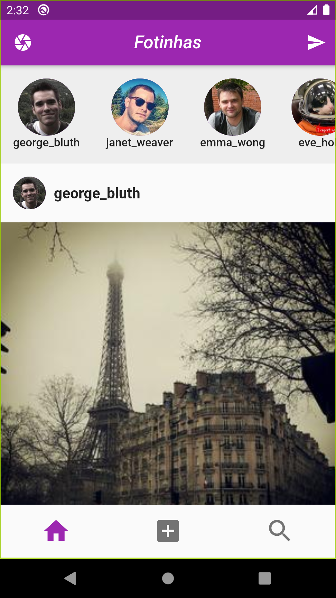

# Introdução a Flutter - WTISC 2020

Repositório para o minicurso de Introdução a Flutter, ministrado no WTISC 2020.

|                                       |                                               |                                               |
| :------------------------------------ | :-------------------------------------------: | :-------------------------------------------: |
|  |  |  |
|                                       |                                               |                                               |

## Aplicações desenvolvidas

- [Fotinhas](https://github.com/robsonsilv4/fotinhas)
- [Contatinhos](https://github.com/robsonsilv4/contatinhos)

## Configuração do ambiente

Flutter:

- Instalação no [Windows](https://flutter.dev/docs/get-started/install/windows)
- Instalação no [Linux](https://flutter.dev/docs/get-started/install/linux)
- Instalação no [macOS](https://flutter.dev/docs/get-started/install/macos)

Editor:

- [Visual Studio Code](https://code.visualstudio.com/)
- [IntelliJ IDEA](https://www.jetbrains.com/pt-br/idea/download/)
- [Android Studio](https://developer.android.com/studio#downloads)

Plugin:

- Flutter para [Visual Studio Code](https://marketplace.visualstudio.com/items?itemName=Dart-Code.flutter)
- Flutter para [IntelliJ IDEA e Android Studio](https://plugins.jetbrains.com/plugin/9212-flutter)

## Serviços utilizados:

- [JSON to Dart](https://javiercbk.github.io/json_to_dart/) para serialização
- [Lorem Picsum](https://picsum.photos/) para consulta de fotos
- [REQ|RES](https://reqres.in/) para consulta de usuários

## Licença

Este projeto está sob os termos da licença [MIT](LICENSE).

Feito com ❤️
